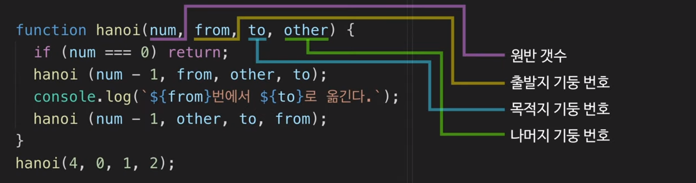
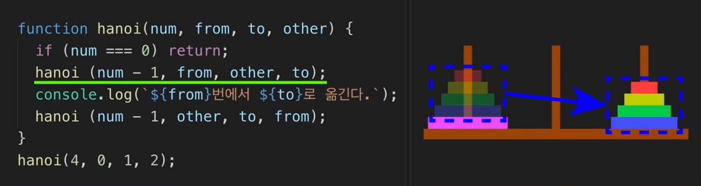
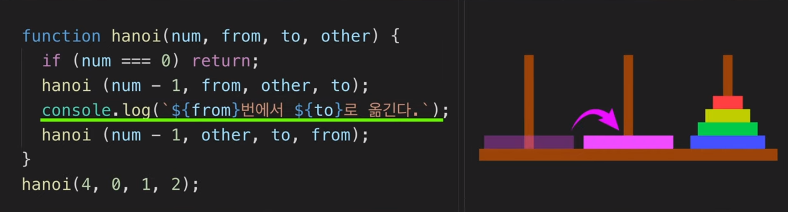
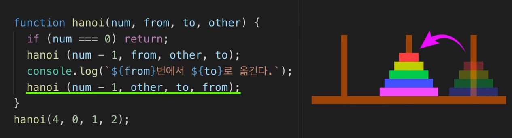

# 재귀함수 ( 하노이 탑 )


> 1. 한 번에 한개의 층만을 다른 기둥으로 옮길 수 있다.
> 2. 옮기려는 기둥에는 아무것도 없거나 옮기려는 층보다 큰 층이 있을 경우에만 옮길 수 있다.
> 3. 옮기려는 기둥에 옮기려는 층보다 작은 층이 이미 있을 경우 그 기둥으로 옮길 수 없다.
> 4. 가능한 적은 회수로 전체 탑을 다른 기둥으로 옮긴다.


## 코드 설명

#### 함수 정의







맨 아래 원반을 목적지로 이동시킨다.




마지막으로, 다른곳으로 옮겼던 원반들을 그 위에 얹는다..




## 파이썬 코드

```python
# 원판의 개수 n

def hanoi(n,start, temp, end):
    # 마지막 원판을 어떻게 옮기느냐...
    # => 마지막 원판을 제외한 나머지를 옮기느냐...
    if n:
        hanoi(n-1, start, end, temp)
        print(f'{n}번째 원판을, {start}에서 {end}로')
        print('---')
        hanoi(n-1, temp, start, end)


hanoi(5, 'a', 'b', 'c')
```


- 원판 움직이는 횟수

```python
# 방법 출력해야 하는데 횟수만 뽑아버림
# n 개의 원판이 주어진다. n 은 1이상

def hanoi(n):
    if n == 1:
        return 1
    else: 
        return hanoi(n-1) + 1 + hanoi(n-1)
    
    
    
print(hanoi(1))
print(hanoi(2))
print(hanoi(3))
print(hanoi(4))
print(hanoi(5))
```

