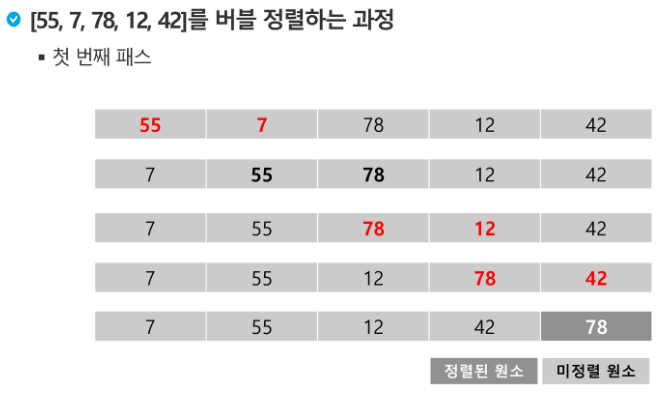
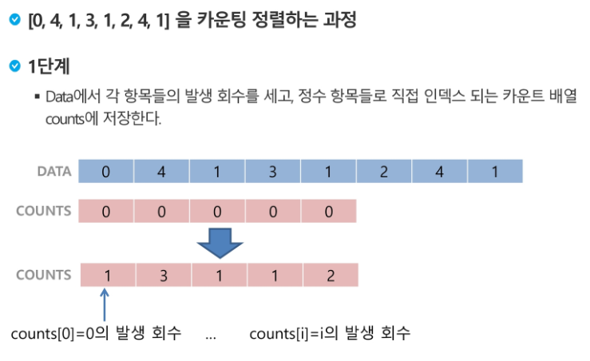
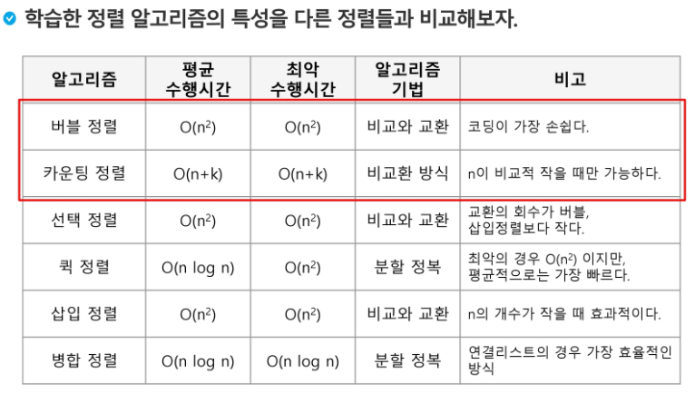

### 1. 숫자들의 각 자리수 구하기

> - number 를 10 으로 나눈 몫과 나머지
>
> - 몫을 다시 10 으로 나눈 몫과 나머지 
>
> - 반복하면 각 자리수를 구할 수 있다...

```python
number = 5184
res = []

while number != 0:
    a = number % 10
    res.append(a)
    number = number//10

print(res[::-1])    # [5, 1, 8, 4]
```


### 2.정렬

1. **버블정렬** ( Bubble Sort )

> - 인접한 두개 원소 비교하여 자리를 계속 교환하는 방식
>
> - 시간복잡도 O(n^2)
>
> - 한 단계가 끝나면 가장 큰 원소가 마지막 자리로 정렬된다.



```python
def BubbleSort(a):    # 정렬할 List
    for i in range(len(a)-1, 0, -1):    # 범위의 끝 위치 ( n-2 )
        for j in range(0, i):
            if a[j] > a[j+1]:
                a[j], a[j+1] = a[j+1], a[j]

```


2. 카운팅 정렬 ( Counting Sort )

> - 항목들의 순서를 결정하기 위해 집합에 각 항목이 몇 개씩 있는지 세는 작업을 하여,
>   선형 시간에 정렬하는 효율적인 알고리즘
> - 시간복잡도 O(n + k) : n은 리스트 길이, k는 정수의 최대값
> - **카운트배열을 이용함 [0, 0, 0, 0, 0, 0, 0]**



```python
def Counting_Sort(A, B, k):
# A [1 .. n] -- 입력 배열 (1 to k)
# B [1 .. n] -- 정렬된 배열.
# C [1 .. K] -- 카운트 배열.

C = [0] * k    # 카운트배열을 만들어준다.

for i in range(0, len(B)):
    C[A[i]] += 1
    
for i in range(1, len(C)):
    C[i] += C[i-1]
    
for i in range(len(B)-1, -1, -1):
    B[C[A[i]]-1] = A[i]
    C[A[i]] -= -1
```


- 정렬 알고리즘 비교
  

