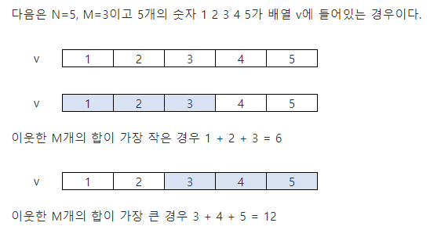
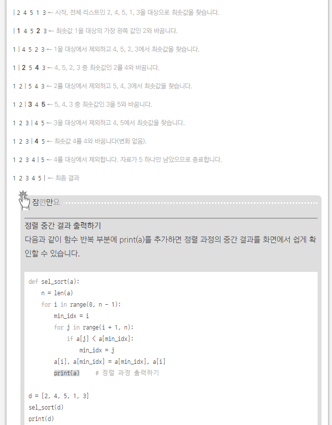

### 1. 숫자들의 각 자리수 구하기

> - number 를 10 으로 나눈 몫과 나머지
>
> - 몫을 다시 10 으로 나눈 몫과 나머지 
>
> - 반복하면 각 자리수를 구할 수 있다...

```python
number = 5184
res = []

while number != 0:
    a = number % 10
    res.append(a)
    number = number//10

print(res[::-1])    # [5, 1, 8, 4]
```


```python
digits = []
while n != 0:
    n, r = (n // 10), (n % 10) # n : 몫, r : 나머지
    digits.append(r)

print(digits)
```


### 2.정렬

1. **버블정렬** ( Bubble Sort )

> - 인접한 두개 원소 비교하여 자리를 계속 교환하는 방식
>
> - 시간복잡도 O(n^2)
>
> - 한 단계가 끝나면 가장 큰 원소가 마지막 자리로 정렬된다.


```python
def BubbleSort(a):    # 정렬할 List
    for i in range(len(a)-1, 0, -1):    # 범위의 끝 위치 ( n-2 )
        for j in range(0, i):
            if a[j] > a[j+1]:
                a[j], a[j+1] = a[j+1], a[j]

```


2. 카운팅 정렬 ( Counting Sort )

> - 항목들의 순서를 결정하기 위해 집합에 각 항목이 몇 개씩 있는지 세는 작업을 하여,
>   선형 시간에 정렬하는 효율적인 알고리즘
> - 시간복잡도 O(n + k) : n은 리스트 길이, k는 정수의 최대값
> - **카운트배열을 이용함 [0, 0, 0, 0, 0, 0, 0]**


```python
def Counting_Sort(A, B, k):
# A [1 .. n] -- 입력 배열 (1 to k)
# B [1 .. n] -- 정렬된 배열.
# C [1 .. K] -- 카운트 배열.

C = [0] * k    # 카운트배열을 만들어준다.

for i in range(0, len(B)):
    C[A[i]] += 1
    
for i in range(1, len(C)):
    C[i] += C[i-1]
    
for i in range(len(B)-1, -1, -1):
    B[C[A[i]]-1] = A[i]
    C[A[i]] -= -1
```


- 정렬 알고리즘 비교
  


### 3. 구간합(부분합) [중요]

> 부분합..
>
> `N-M+1` 번 도는 것이 가장 중요




```python
T = int(input())

for tc in range(1, T+1):
    # 갯수, 구간수
    N, M = map(int, input().split())
    d = list(map(int, input().split()))
    
    # 구간합들이 모여있는 arr 생성
    arr = []
    # N-M+1 번 돈다... 중요
    for i in range(N-M+1):
        # 인덱스 + 구간만큼 
        arr.append(sum(d[i:i+M]))

    print('#{} {}'.format(tc, max(arr) - min(arr)))
```


### 4. 셀렉션 알고리즘 ( sorting )

___

> 순서
>
> 1.  처리할 대상 범위에서 최소값을 찾는다.
> 2. 그 값과 범위의 맨 앞에 있는 값을 서로 바꾸는 과정 반복




```

```


### 5. 2차원배열 지그재그 순회

___

```python
n = int(input())
matrix = [[0]*n for i in range(n)]
cnt = 0
for i in range(0, n):
    if i % 2:
        for j in range(n-1, -1, -1):
            cnt += 1
            matrix[i][j] = cnt
    else:
        for j in range(0, n):
            cnt += 1
            matrix[i][j] = cnt
for i in range(0, n):
    for j in range(0, n):
        print(matrix[i][j], end=' ')
    print()
```


### 6. 부분집합 구하기

___

```python
def power_set(items):
    N = len(items)
    # enumerate the 2 ** N possible combinations
    for i in range(2 ** N):
        combo = []
        for j in range(N):
            # test bit jth of integer i
            if (i >> j) % 2 == 1:
                combo.append(items[j])
        yield combo
```


### 7. 2차원배열 [달팽이 숫자 출력]

___

```python
n = int(input())
matrix = [[0]*n for i in range(n)]
cnt = 0
offset = 0
row = n
col = n

while row > 0 and col > 0:
    for i in range(offset, offset+col):
        cnt += 1
        matrix[offset][i] = cnt
    for i in range(offset+1, offset+row):
        cnt += 1
        matrix[i][offset+col-1] = cnt
    for i in range(offset+col-2, offset-1, -1):
        cnt += 1
        matrix[offset+row-1][i] = cnt
    for i in range(offset+row-2, offset, -1):
        cnt += 1
        matrix[i][offset] = cnt
    offset += 1
    row -= 2
    col -= 2
    
for i in range(0, n):
    for j in range(0, n):
        print(matrix[i][j], end=' ')
    print()
```


### 8. Stack 

> 백준, 9012번 문제
>
> 1. ' ( ' 가 나오면 `stack` 에 ' ( '  넣어줌
> 2. ' ) ' 가 나오면, 스택에서 ' ( ' 를 빼준다.
>    - `stack` 이 비어있는지 
>      - 비어있다면 			=> `False` 
>      - 비어있지않으면      => `pop()` 
>    - `stack` 이 비어있다면   => `True` 
>    - `stack` 이 비어있지 않다면 => `False` 

```python
import sys

T = int(sys.stdin.readline())
for _ in range(T):
    # readline 은 뒤에 \n 도 포함시키므로 .srtip() 을 써줘야한다.
    D = list(sys.stdin.readline().strip()) 
    stack = 0
    for p in D:
        if p == '(':
            stack += 1
        else:
            if stack != 0:
                stack -= 1
            else:
                print('NO')
                break
    else:
        if stack == 0:
            print('YES')
        else:
            print('NO')
```


##### SWEA 문제

> 4873문제
>
> 반복문자 지우기

```python

for tc in range(1, T+1):
    stack = []
    D = input()
    for c in D:
        if len(stack) != 0:
            if stack[-1] == c:
                stack.pop()
            else:
                stack.append(c)
        else:
            stack.append(c)
    print('#{} {}'.format(tc, len(stack)))
```


##### 프로그래머스

- 탑 문제

> stack
>
> 얘에서 왼쪽.

```python
def solution(heights):
    answer = []
    for i in range(len(heights)):
        #for j in range(시작, 끝점, -1)
        for j in range(i, -1, -1):
            if heights[i] < heights[j]: # 현재 탑보다 비교탑이 높을때
                answer.append(j+1)
                break
        else:
            answer.append(0)

    return answer
```

```python
 # 다른풀이
def solution(heights):
    answer = []
    
    for i in range(len(heights)):
        stack = []
        for j in range(i):
            if heights[i] < heights[j]:
                stack.append(j+1) # 인덱스만 들어있는 스택
        if len(stack) != 0:
            answer.append(stack.pop())
        else:
            answer.append(0)
    return answer
```


- 주식 가격 문제

> `stack` 문제

```python
def solution(prices):
    answer = []
    for i in range(len(prices)): # -1 ???
        cnt = 0
        for j in range(i+1, len(prices)):
            if prices[i] <= prices[j]: 
                cnt += 1
            else:
                cnt += 1 
                break
        answer.append(cnt)
            
    return answer
```


```python
def solution(prices):
    answer = []
    for i in range(len(prices)): # -1 ???
        cnt = 0
        for j in range(i+1, len(prices)):
            cnt += 1
            if prices[i] > prices[j]:
                break
            # if prices[i] <= prices[j]: 
            #     cnt += 1
            # else:
            #     cnt += 1 
            #     break
        answer.append(cnt)
            
    return answer
```

