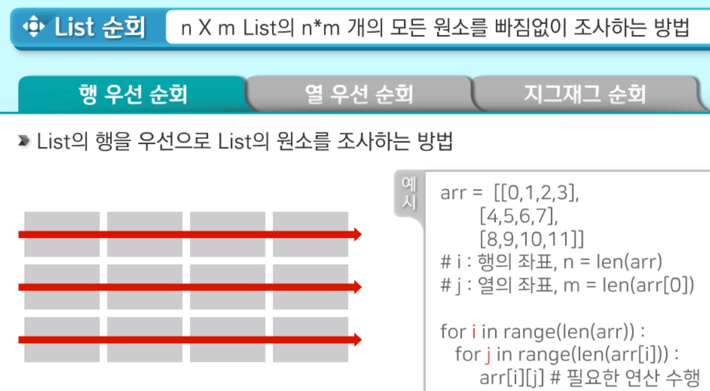
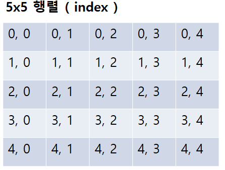
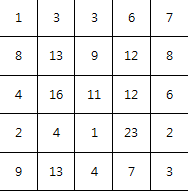

# 2차원 리스트

> 리스트 안에 리스트
>
> ```python
> 2_list = [
> 	    	[1,2,3,4]
> 	        [5,6,7,8]
> 	        [9,10,11,12]
> 	      ]
> ```


1. 행 (row)

   - [1,2,3,4]

   - [5,6,7,8]

   - [9,10,11,12]

   - ```python
     행의 갯수 = len(2_list)
     ```

     

2. 열 (column)

   - [1]
     [5]
     [9]

   - ```python
     열의 갯수 = len(2_list[0])
     ```

     


3.  2차원 리스트 배열 초기화

```python
2_list = [ [1,2,3], [1,2,3], [1,2,3] ]
2_list = [ [1,2,3] ] * 3
2_list = [ [1,2,3] for i in range(3) ]
```


4. 입력받은 값을 2차원 배열로 만드는 방법
   - 첫째 줄에 n행 m열
   - 둘째 줄부터 n*m의 행렬 데이터가 주어질 경우

```python
3 4
0 1 0 0
0 0 0 0
0 0 1 0

n, m = map(int, input().split())
mylist = [list(map(int, input().split())) for _ in range(n)]
```


5. 2차원 List 의 순회

   - 행 우선 순회 
     

     

   - 열 우선 순회

   - 지그재그 순회


6. 2차원리스트 인덱스 구하기 ( 예시. 5x5 행렬 )





```python
0,0 => 1
1,0 => 8

(4x4의 행렬의 인덱스를 알고싶다면..)
for i in range(4**2):
	count = 0
	row, col = divmod(i, 4)
	print(row, col)
```


