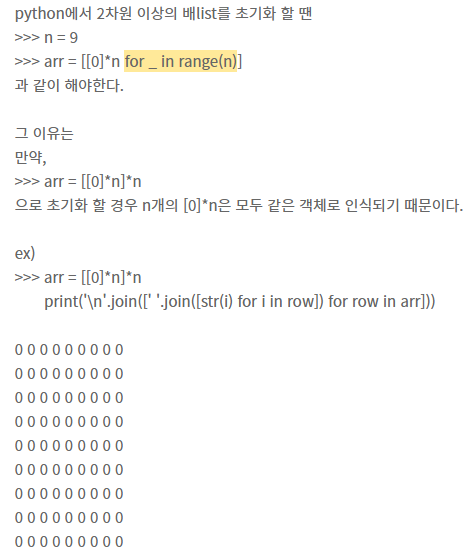
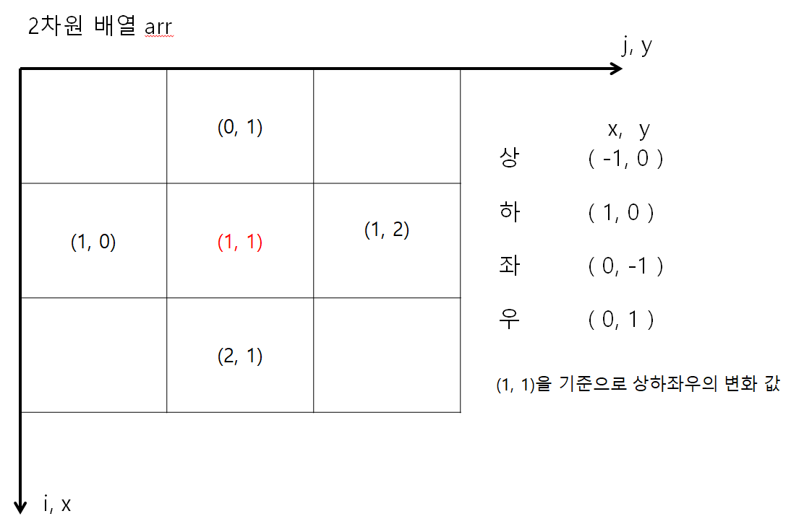
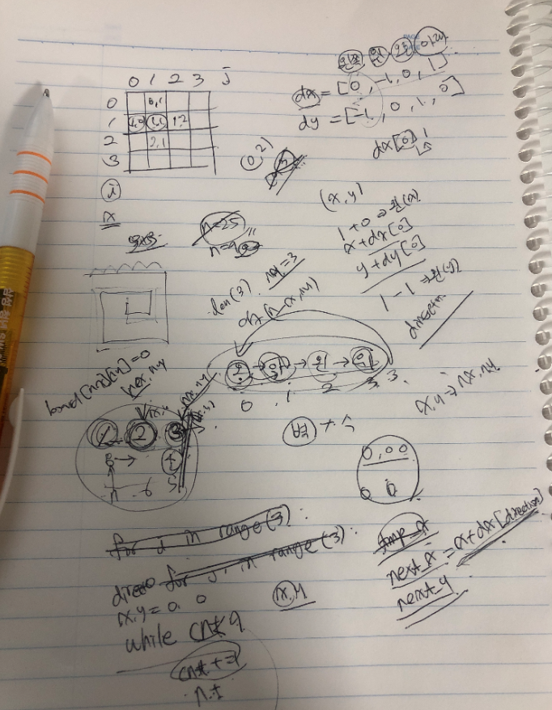
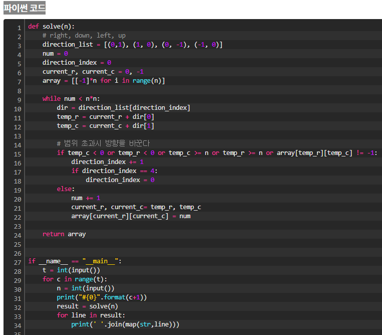
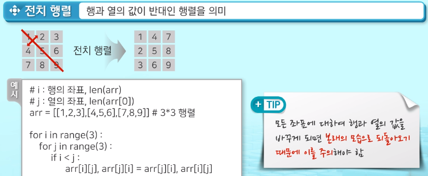
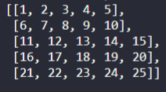

# 2차원 리스트

> 리스트 안에 리스트
>
> ```python
> 2_list = [
> 	    	[1,2,3,4]
> 	        [5,6,7,8]
> 	        [9,10,11,12]
> 	      ]
> ```


1. 행 (row)

   - [1,2,3,4]

   - [5,6,7,8]

   - [9,10,11,12]

   - ```python
     행의 갯수 = len(2_list)
     ```

     

2. 열 (column)

   - [1]
     [5]
     [9]

   - ```python
     열의 갯수 = len(2_list[0])
     ```

     


3.  **2차원 리스트 배열 초기화**

```python
2_list = [ [1,2,3], [1,2,3], [1,2,3] ]
2_list = [ [1,2,3] ] * 3
2_list = [ [1,2,3] for i in range(3) ]
```




4. 입력받은 값을 2차원 배열로 만드는 방법
   - 첫째 줄에 n행 m열
   - 둘째 줄부터 n*m의 행렬 데이터가 주어질 경우

```python
3 4
0 1 0 0
0 0 0 0
0 0 1 0

n, m = map(int, input().split())
mylist = [list(map(int, input().split())) for _ in range(n)]
```


5. 2차원 List 의 순회

   - 행 우선 순회 
     

     

   - 열 우선 순회

     - ```python
       matrix = [
       	[1,2,3],
       	[4,5,6],
       	[7,8,9]
       ]
       
       for i in range(len(matrix)):
           for j in range(len(matrix[0])):
               print(matrix[j][i])
       ```
   
       
   
   - 지그재그 순회
   
     - ```python
       n = int(input())
       matrix = [[0]*n for i in range(n)]
       cnt = 0
       for i in range(0, n):
           if i % 2:
               for j in range(n-1, -1, -1):
                   cnt += 1
                   matrix[i][j] = cnt
           else:
               for j in range(0, n):
                   cnt += 1
                   matrix[i][j] = cnt
       for i in range(0, n):
           for j in range(0, n):
               print(matrix[i][j], end=' ')
           print()
       ```


6. 2차원리스트 인덱스 구하기 ( 예시. 5x5 행렬 ) 좌표


```python
0,0 => 1
1,0 => 8

(4x4의 행렬의 인덱스를 알고싶다면..)
for i in range(4**2):
	count = 0
	row, col = divmod(i, 4)
	print(row, col)
```


- 델타를 이용한 2차원리스트 탐색 ( 상 하 좌 우 )

  - 
    
    
    
    ```python
    # 2차원 배열의 양끝에서 상하좌우를 탐색하다가는 인덱스를 벗어나는 에러가 발생하는것 유의하여
    # 인덱스의 범위 값 설정할때 조심해야 한다.
    
    matrix = [
    	[1,2,3,4]
    	[5,6,7,8],
    	[9,10,11,12]
    ]
    dx = [0,0,-1,1]  # 왼 오 위 아래
    dy = [-1,1,0,0]
    
    for x in range(len(matrix)):
        for y in range(len(matrix[0])):
            for i in range(4):
                testX = x + dx[i]
                testY = y + dy[i]
                print(matrix[testX][testY])
        
        
    ```


- ex) 달팽이 문제
  

  
  
  
  
  
  
  
  


- 전치 행렬 구하기
  - 행과 열의 값이 반대인 행렬

1. 일반적인 알고리즘 방법으로 풀기




2. 내장함수 .zip() 을 사용하여 풀기

```python
matrix = [
	[1,2,3,4],
	[5,6,7,8],
	[9,10,11,12]
]
# 3x4 => 4x3 행렬로 바뀜
# 이스터에그 * 으로 matrix를 unpacking 하여 각 리스트들으로 뽑아준다.
a = list(zip(*matrix))
print(a)
```


- 2차원 배열 생성

  - 1~N까지 만들기

  - ```python
    tmp =[ [i *5 + j for j in range(1, 6)] for i in range(N)] # N = 5
    ```

  - 

    

-  2차원배열 회전 ( 90도 ) 방법 2가지

  - ```python
    rotated = Zip(*matrix[::-1])
    ```

  - ```python
    def rorate(matrix):
    	N = len(m)
        ret = [[0] * N for _ in range(N)]
        
        for r in range(N):
            for c in range(N):
                # 바뀐배열의 행과 바뀌기전 배열의 열이 같다.
                ret[c][N-1-r] = matrix[r][c]
        return ret
    ```


- 2차원 배열안에 같은 값이 있을때 더 큰걸로 출력하기

  ```python
  arr = [ [42, 150], [47, 150], [55, 150] ] 
  
  # 값이 같을때 가장 큰 55 를 출력해보셈
  
  first_arr = [42, 47, 55]
  two_arr = [150, 150, 150]
  
  s = 0
  for first, two in arr: # 42, 150
      if two == max(two_arr):
          s = first
  
  print(s)
  ```

- 