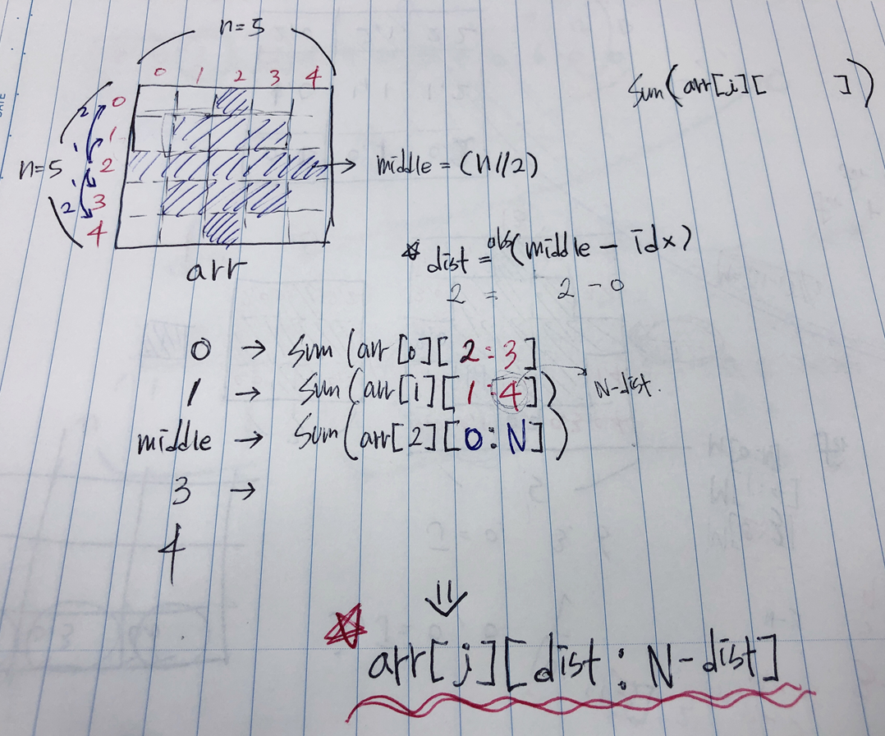
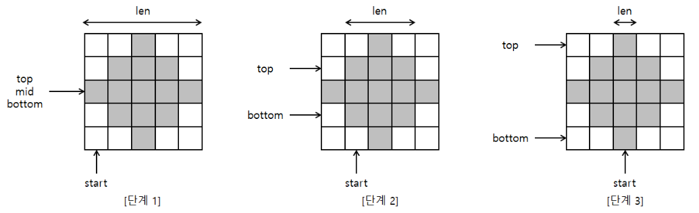

# 알고리즘 규칙 찾기 연습

- swea - D3_2805_농작물 수확하기

```python
T=int(input())
for tc in range(1, T+1):
    N = int(input())
    arr = [list(map(int, input())) for _ in range(N)]
    # pprint(arr)

    middle = N//2 # 중간 값 찾기
    res = 0 # 결과를 담아줄 변수 임의로 만든다.
    for i in range(N):
        dist = abs(middle-i) # 2
        res += sum(arr[i][dist:N-dist])

    print('#{} {}'.format(tc, res))
```

도출과정






