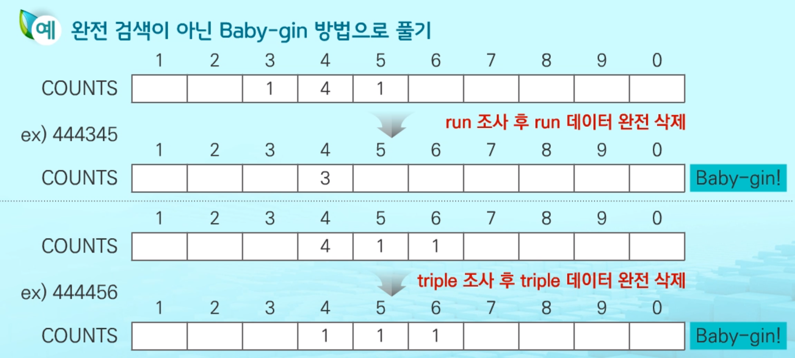
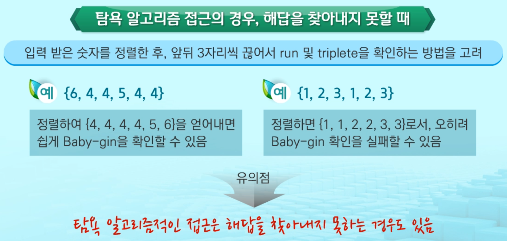

# Greedy Algorithm ( 탐욕 알고리즘 )

> 2020/02/04 00:20 (화) 공부

> 최적 해를 구하는데 사용되는 근시안적인 방법

1. 여러 경우 중 하나를 결정해야 할 때마다 **그 순간에 최적이라고 생각되는 것을 선택해 나가는 방식**으로
   진행하여 최종적인 해답에 도달함
2. 각 선택의 시점에서 이루어지는 결정은 지역적으로는 최적이지만, 
   그것들을 계속 수집하여 최종적인 해답을 만들었다고 하여, 그것이 **최적이라는 보장은 없음**
3. 일반적으로, **머리속에 떠오르는 생각을 검증 없이 바로 구현하면 Greedy 접근**이 됨


- 탐욕 알고리즘 수행 과정
  - 해 선택
    - 현재 상태에서 부분 문제의 최적 해를 구한 뒤, 이를 **부분 해 집합에 추가**함
  - 실행 가능성 검사
    - 새로운 부분 해 집합이 실행 가능한지 확인
    - 곧, **문제의 제약 조건을 위반하지 않는지를 검사**함
  - 해 검사
    - 새로운 부분 해 집합이 **문제의 해가 되는지를 확인**
    - 아직 전체 문제의 해가 완성되지 않았다면 **해 선택부터 다시 시작**함


- 탐욕 알고리즘 ex)

  - 거스름돈 줄이기

    - 어떻게 하면 손님에게 거슬므돈으로 주는 지폐와 동전의 개수를 최소한으로 줄일 수 있을까?

  - 해 선택

    - 가장 좋은 해를 선택
    - 가장 **단위가 큰 동전을 하나골라 거스름돈에 추가**함

  - 실행 가능성 검사

    - 거스름돈이 손님에게 내드려야 할 액수를 초과하는지를 확인
    - 초과한다면 마지막에 추가한 동전을 거스름돈에서 빼고,
      해 선택으로 돌아가서 현재보다 한 단계 작은 단위의 동전을 추가함

  - 해 검사

    - 거스름돈이 손님에게 내드려야 하는 액수와 일치하는지 확인
    - 액수에 모자라면 다시 해 선택으로 돌아가서 거스름돈에 추가할 동전을 고름

    

    

#### 완전 검색 (BF) vs 탐욕 알고리즘

- 완전 검색
  - 경우의 수 모두를 검사하는 것
- 탐욕법
  - 현재 상태에서 부분 문제의 최적 해


#### 탐욕법으로 Baby-gin 문제 풀기




슈도 코드로 표현한 구현

```python
num = 456789    # Baby Gin 확인할 6자리 수
c = [0] * 12    # 6자리 수로부터 각 자리 수를 추출하여 개수를 누적할 리스트

for i in range(6):
c[num % 10] += 1
num //= 10

i = 0
tri = run = 0
while i < 10:
	if c[i] >= 3:    # triplete 조사 후 데이터 삭제
		c[i] -= 3
		tri += 1
		continue
    if c[i] >= 1 and c[i+1] >= 1 and c[i+2] >= 1 :    # run 조사 후 삭제
    	c[i] -= 1
    	c[i+1] -= 1
    	c[i+2] -= 1
    	run += 1
    	continue
    i += 1

if run+tri == 2 :
	print('Baby Gin')
else:
	print('Lose')
```


`탐욕 알고리즘적인 접근은 해답을 찾아내지 못하는 경우도 있음` 




