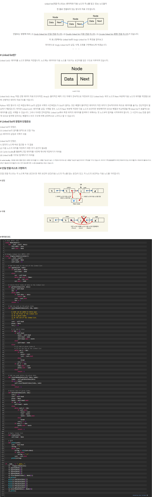

# Linked List ( 연결 리스트 )

- 종류
  - 단일 연결 리스트 ( Singly Linked List )
  - 이중 연결 리스트 ( Doubly Linked List )
  - 환형 연결 리스트 ( Circular Linked List )

### (1) 단일 연결 리스트

___

[참조 블로그](https://daimhada.tistory.com/72)

