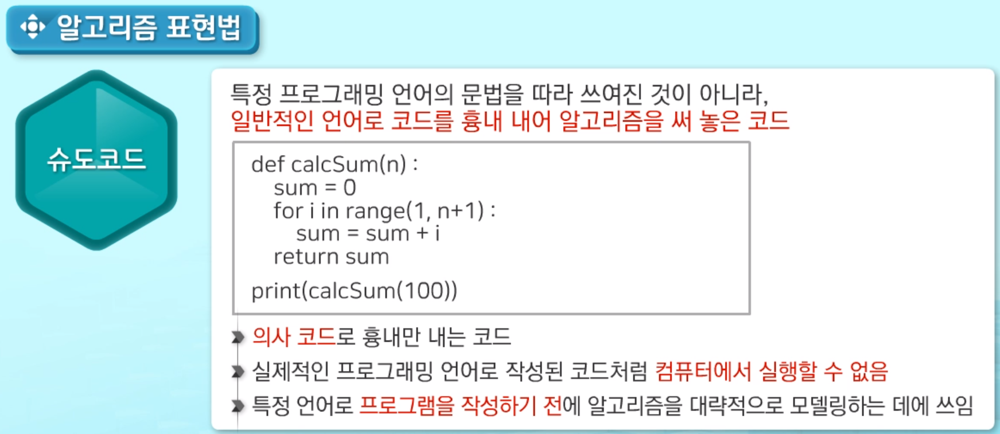
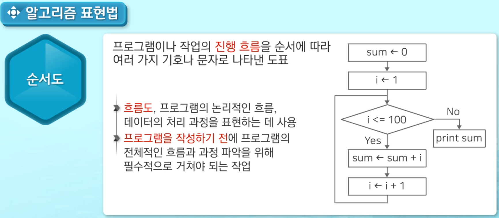
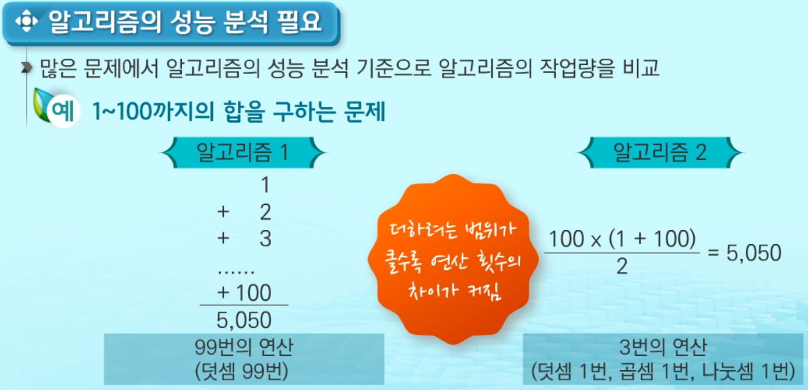
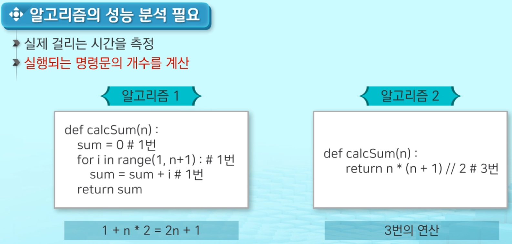
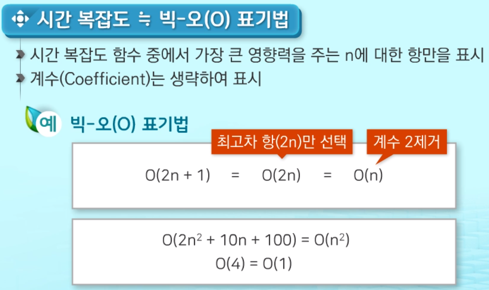
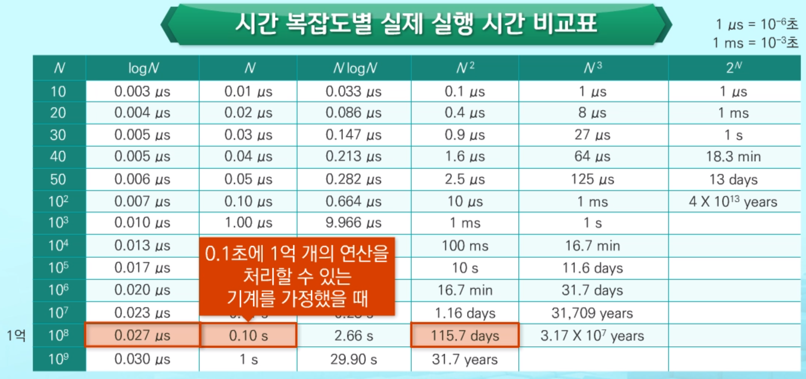
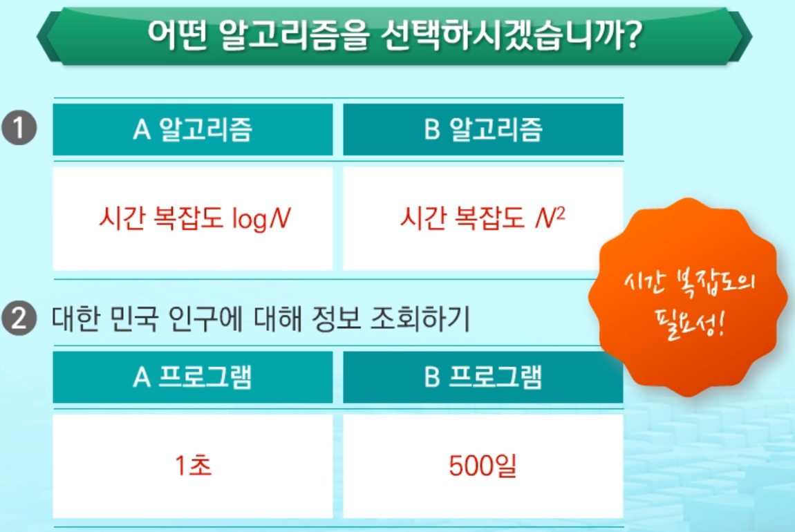

# 알고리즘

#### 2020/02/02 (일) 공부

___

- 알고리즘 개요

  - 알고리즘 표현법

    - 슈도 코드
      

    - 순서도

      

  

  - 알고리즘 성능 분석
    - 무엇이 좋은 알고리즘인가?
      - `정확성` : 얼마나 정확하게 동작하는가
      - `작업량` : 얼마나 적은 연산으로 원하는 결과를 얻어내는가? 
      - `메모리 사용량` : 얼마나 적은 메모리를 사용하는가?
      - `단순성` : 얼마나 단순한가?
      - `최적성` : 더 이상 개선할 여지 없이 최적화 되었는가?

  

  - 알고리즘 성능 분석 필요

    > 성능분석 기준으로 `알고리즘의 작업량` 비교

    - 1 ~ 100까지의 합을 구하는 문제
      

    - 실제 걸리는 시간을 측정

    - **실행되는 명령문의 개수를 계산** : 시간복잡도 측정
      

      < 알고리즘 1 > : 시간 복잡도 2n+1
      < 알고리즘 2 > : 시간 복잡도 3

  

- 시간 복잡도 표기법

  - 빅-오(O) 표기법

    - 시간 복잡도 함수 중에서 가장 큰 영향력을 주는 n에 대한 항만을 표시

    - 계수(Coefficient)는 생략하여 표시

      

    - 시간 복잡도별 실제 실행 시간 비교표

      

      
      

  - 시간복잡도가 필요한이유

    - 

      

