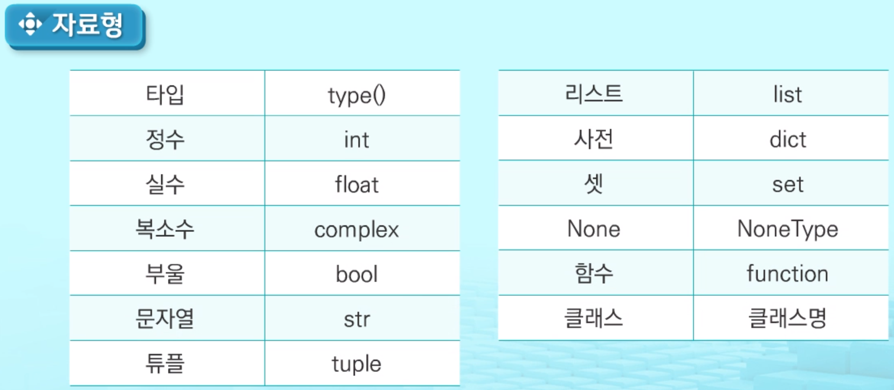
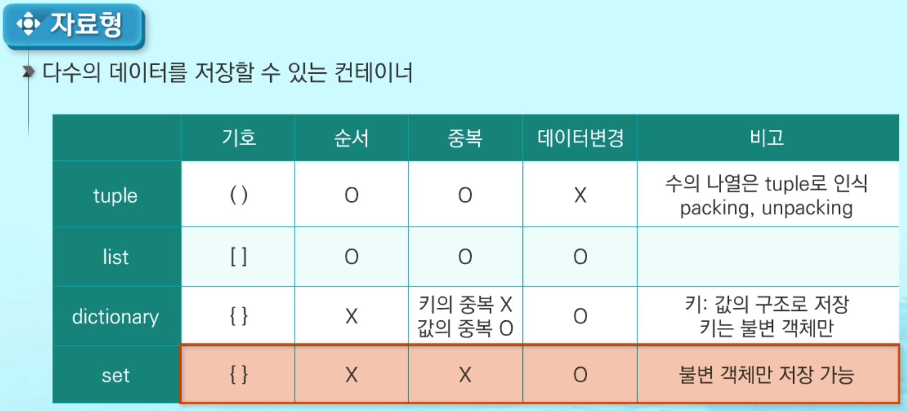
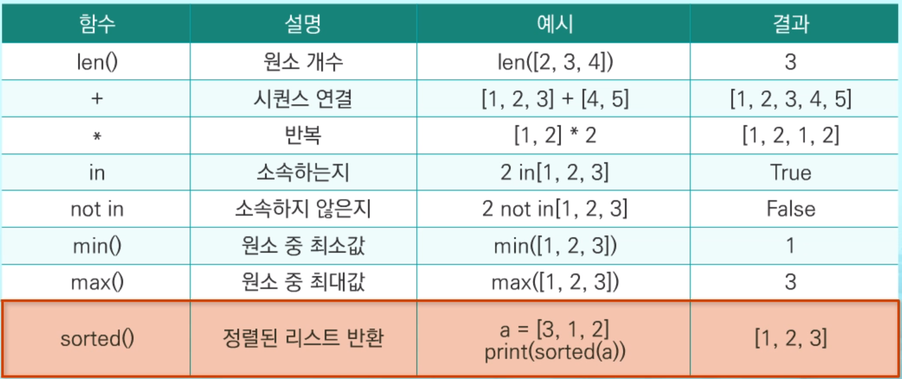
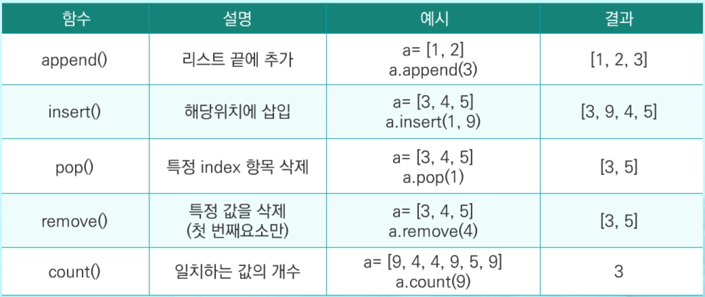
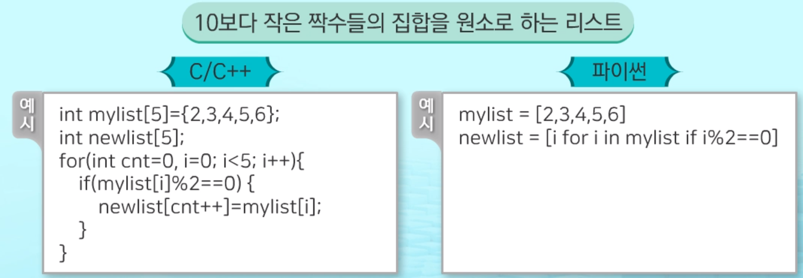

# List

#### 2020/02/02 (sun) study

___


###  1. 파이썬 소개

> 1991년 귀도 반로섬이 개발한 프로그래밍 언어

1. 인터프리터 언어로 독립적인 플랫폼
2. 객체지향
3. 파이썬2와 파이썬3 버전이 배포중, 파이썬 재단은 `파이썬3을 권장`


- 변수

  1. 파이썬에서는 모든 자료는 객체

     - Java나 C에서 사용되는 기본형 타입 변수도 파이썬에서는 객체

  2. 변수의 선언은 따로 없음

     - 변수에 값을 초기화 시 변수가 메모리에 생성

     - ```python
       하나의 변수에 다른 타입의 값을 변수에 저장할 수 있음
       a = 3
       a = 'hello'
       ```

  3.  자료형

     - 
     - 다수의 데이터를 저장할 수 있는 **컨테이너**
       


- 리스트(List)

1. 배열(List) : 같은 타입 변수들을 하나의 이름으로 열거하여 사용하는 자료구조
   - 파이썬의 리스트는 C나 Java에서의 배열과 비슷한 자료구조


2. 값을 초기화 하기전에, 변수를 미리 만들어 두어야 할 경우

   ```python
   num = []
   arr = list()    # 생성자
   ```

3.  **배열과 리스트의 차이점**

   - |        |             배열              |          리스트           |
     | :----: | :---------------------------: | :-----------------------: |
     | 데이터 |   같은 타입의 데이터만 저장   |   다양한 데이터를 저장    |
     |  크기  | 처음 지정한 후 변경할 수 없음 | 가변적으로 변경할 수 있음 |

   - 배열보다 리스트가 사용하기 편리함


4. 시퀀스(Sequence) 자료형

   - 순서가 존재함으로, **인덱싱과 슬라이싱**의 연산 모두 적용가능

     - 인덱싱

       - 시퀀스 자료형에서 하나의 요소를 인덱스 연산자를 통하여 참조하는 것

       - ```python
         arr = [4,5,6,7,8,9]
         arr[0] # 4
         arr[-1] # 9
         ```

         

     - 슬라이싱

       - 시퀀스 자료형의 원하는 범위를 선택하는 연산

       - ```python
         arr = [4,5,6,7,8,9]
         
         arr[1:3] #[5,6]
         arr[:3] #[4,5,6]
         ```

5. 함수와 연산

   - 

   

   - 


6. **리스트 함축 (List Comprehension)**

   > 수학에서 집합을 정의하는 표현식과 유사함

   - 10보다 작은 짝수들의 집합을 원소로 하는 리스트

     

     


