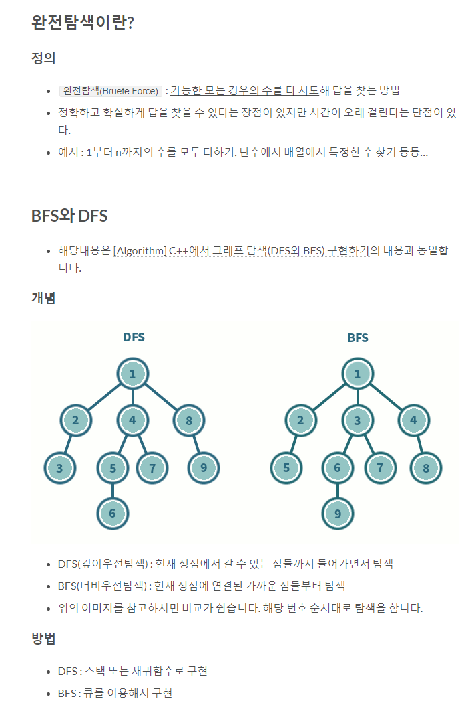

# Exhaustive Search (완전 검색)

#### 2020/02/03 (월) 공부

___

### 1. Exhaustive Search ( 완전 검색 )

> 문제의 해법으로 생각할 수 있는 모든 경우의 수를 나열해보고 확인하는 기법

1. `Brute-Force` 혹은 `Generate-and-Test` 기법이라고도 불림
2. 모든 경우의 수를 테스트한 후, 최종 해법을 도출함
3. 일반적으로 경우의 수가 상대적으로 작을 때 유용함
4. 모든 경우의 수를 생성하고 테스트하기 때문에 수행 속도는 느리지만,
   해답을 찾아내지 못할 확률이 작음
5. 주어진 문제를 풀때, 우선 완전 검색으로 접근하여 해답을 도출한 후,
   성능 개선을 위해 다른 알고리즘을 사용하고 해답을 확인하는 것이 바람직함

- Baby-gin 게임

  - 

    

  - 

    

  - 완전검색방법으로 풀어보기

  - 

### 2. 순열

> 서로 다른 것들 중 몇개 를 뽑아서 한줄로 나열하는것

- DFS , BFS

