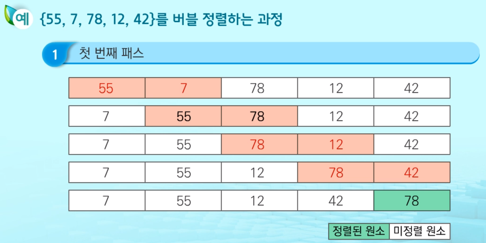
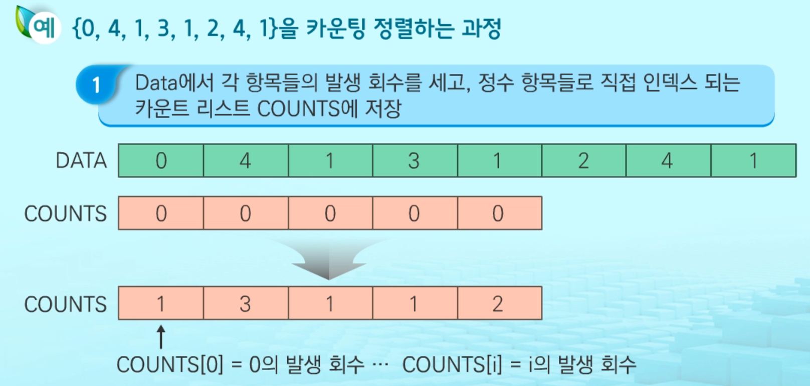
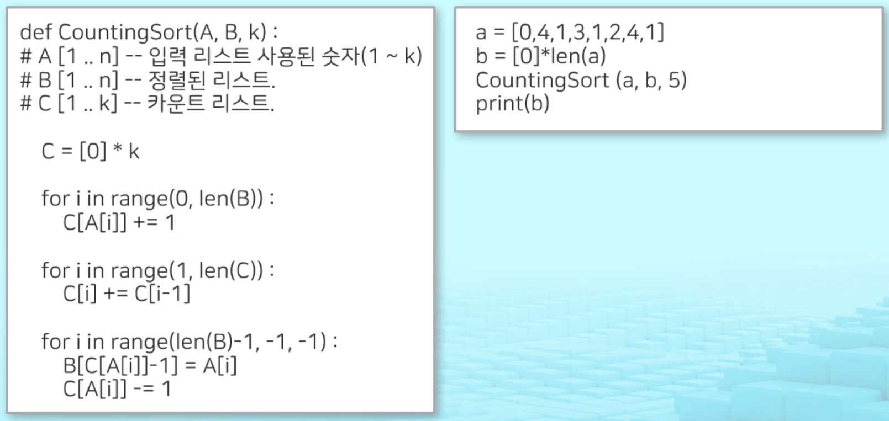
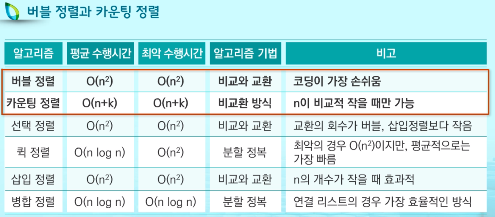

# Sort

2020/02/04 00:21 Sort 공부

___

### 1. 정렬이란?

- 2개 이상의 자료를 특정 기준에 의해 작은 값부터 큰 값(오름차순: ascending),
  혹은 그 반대의 순서대로(내림차순: descending) 재배열 하는것
  `키란 자료를 정렬하는 기준이 되는 특정 값`
  ex) 서류 번호대로 정렬하기, 카드 번호대로 정렬하기

  

- 대표적인 **정렬 방식의 종류**
  - 버블 정렬
  - 카운팅 정렬
  - 선택 정렬
  - 퀵 정렬
  - 삽입 정렬
  - 병합 정렬


### (1) 버블 정렬

___

> 인접한 두 개의 원소를 비교하며 자리를 계속 교환하는 방식

- 정렬 과정
  - 첫 번째 원소부터 인접한 원소끼리 계속 자리를 교환하면서 맨 마지막 자리까지 이동
  - 한 단계가 끝나면 가장 큰 원소 또는 가장 작은 원소가 마지막 자리로 정렬됨
  - 교환하며 자리를 이동하는 모습이 물 위에 올라오는 거품모양 같아서 `버블정렬` 이라 함
  - 시간 복잡도 = O(n^2)


- [55, 7, 78, 12, 42] 를 버블 정렬하는 과정
  반복.




- 버블정렬 코드구현

```python
def BubbleSort(arr):
    for i in range(len(arr)-1, 0, -1):    # 4번 반복
        for j in range(0, i):
            if arr[j] > arr[j+1]:
                arr[j], arr[j+1] = arr[j+1], arr[j]
```


### (2) 카운팅 정렬

___

> 항목들의 순서를 결정하기 위해 집합에 각 항목이 몇 개씩 있는지
>
> 세는 작업을 하여, 선형 시간에 정렬하는 효율적인 알고리즘


- 정렬과정
  - 정수나 정수로 표현할 수 있는 자료에 대해서만 적용 가능
    각 항목의 **발생 회수를 기록**하기 위해, 정수 항목으로 인덱스되는 **카운트들의 리스트를 사용**하기 때문
  - 카운트들을 위한 충분한 공간을 할당하려면 집합 내의 가장 큰 정수를 알아야 함
  - 시간 복잡도 = O(n + k) : 
    - n 은 리스트의 개수
    - k 는 정수의 최대 값


- [0, 4, 1, 3, 1, 2, 4, 1] 을 카운팅 정렬 하는 과정




- 슈도 코드




### (3) 정렬 특징

___



