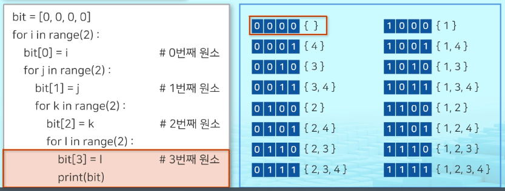
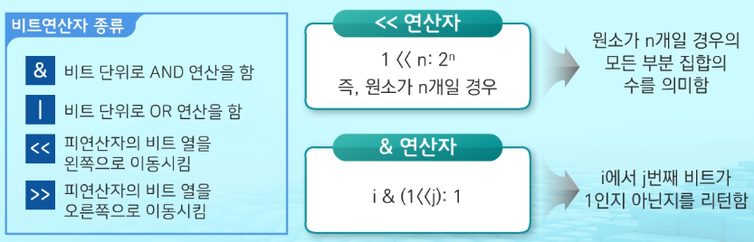
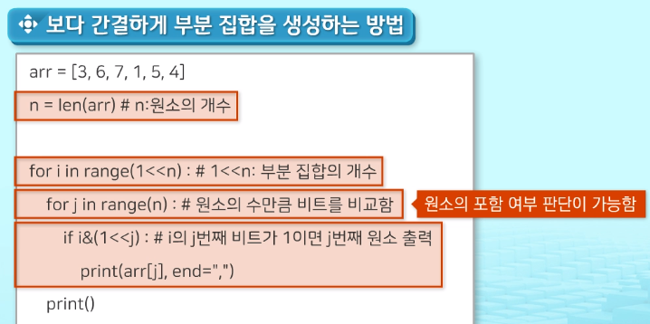

# 부분 집합

2020/02/05 (수)


### 1. 부분 집합의 합

> 유한 개의 정수로 이루어진 집합이 있을 때, 이 집합의 부분 집합 중에서 **그 집합의 원소를 모두 더한 값이 0 이 되는 경우**가 있는지를 알아내는 문제

- 완전검색(Brutal Force) 로 우선 **모든 부분 집합을 생성** => 각 부분 집합의 합을 계산
- <u>주어진 집합의 부분 집합을 생성하는 방법 생각해 보기</u>


Q. 어떤 집합의 부분 집합을 구할 경우 부분 집합의 총 개수는?

- 집합의 원소가 n개일 때, 공집합을 포함한 `부분 집합의 수는 2^n` 개
- 각 원소를 부분 집합에 포함시키거나 포함시키지 않는는 2가지 경우를
  모든 원소에 적용한 경우의 수와 같음
- {1,2,3,4} => 2^4 => 16개 ( 부분집합의 개수 )


### 2. Loop를 이용하여 확인하고, 부분 집합을 생성하는 방법

```python
bit = [0, 0, 0, 0]
for i in range(2):				# 0번째 원소
    bit[0] = i
    for j in range(2):			# 1번째 원소
        bit[1] = j
        for k in range(2):		# 2번째 원소
            bit[2] = k
            for l in range(2):	# 3번째 원소
                bit[3] = l
                print(bit)		# 생성된 부분집합 출력
```




### 3. 비트 연산자

> 0과 1로 이루어진 이진수에 대한 연산을 수행하는 연산자






